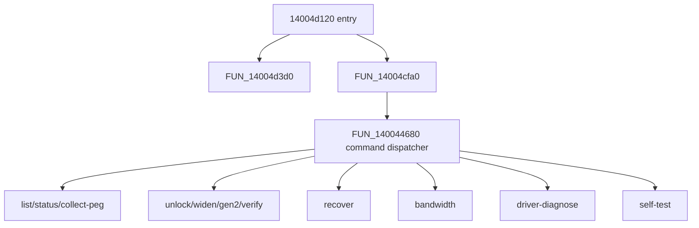
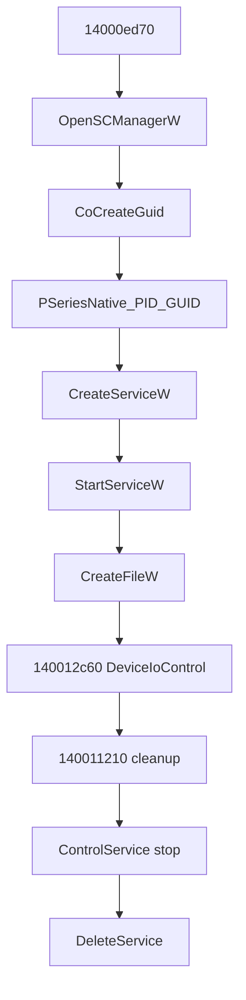
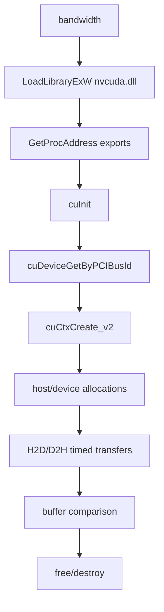

# Function Call Graph

## Entry and command graph

```mermaid
flowchart TD
    E[14004d120 entry] --> I1[FUN_14004d3d0]
    E --> I2[FUN_14004cfa0]
    I2 --> D[FUN_140044680 command dispatcher]
    D --> LC[list/status/collect-peg]
    D --> HW[unlock/widen/gen2/verify]
    D --> REC[recover]
    D --> CUDA[bandwidth]
    D --> DIAG[driver-diagnose]
    D --> ST[self-test]
```

## Temporary service graph

```mermaid
flowchart TD
    D[14000ed70] --> SCM[OpenSCManagerW]
    SCM --> GUID[CoCreateGuid]
    GUID --> NAME[PSeriesNative_PID_GUID]
    NAME --> CS[CreateServiceW]
    CS --> SS[StartServiceW]
    SS --> CF[CreateFileW]
    CF --> IO[140012c60 DeviceIoControl]
    IO --> CL[140011210 cleanup]
    CL --> STOP[ControlService stop]
    STOP --> DEL[DeleteService]
```

## NVIDIA graph

```mermaid
flowchart TD
    BW[bandwidth] --> DLL[LoadLibraryExW nvcuda.dll]
    DLL --> PROC[GetProcAddress exports]
    PROC --> INIT[cuInit]
    INIT --> DEV[cuDeviceGetByPCIBusId]
    DEV --> CTX[cuCtxCreate_v2]
    CTX --> BUF[host/device allocations]
    BUF --> XFER[H2D/D2H timed transfers]
    XFER --> VERIFY[buffer comparison]
    VERIFY --> CLEAN[free/destroy]
```
